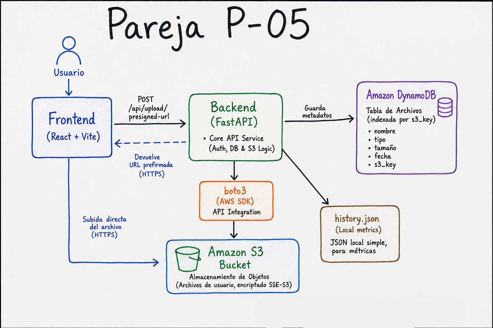

# ArchivaCloud P-05

# Índice
- Integrantes
- Descripción
- Arquitectura
- Tecnologías
- Requisitos
- Instalación
- Variables de entorno
- Endpoints
- Estructura del proyecto
- Seguridad
- Feature extra
- Auditoría de dependencias
- Referencias


# Integrantes
- Giorgio Wojciechowski
- Dilan Espinoza

# Descripción
Sistema de almacenamiento de archivos en Amazon S3. 
*Parámetros únicos respetados (Pareja P-05):*
- Tipos de archivo permitidos: PDF, JPG
- Tamaño máximo: 12 MB
- Nombre del bucket: archivacloud-p05
- Región: us-east-1
- Feature extra obligatoria: Mostrar un contador de "archivos subidos esta semana" en la pantalla principal.

# Tecnologías (Stack)
- Backend: Python 3.10+, FastAPI, Boto3, Uvicorn
- Frontend: React 18 + Vite
- Amazon DynamoDB
- Nube: AWS S3 y IAM

# Cómo ejecutar el backend localmente
1. Entrar a la carpeta: cd backend
2. Crear y activar el entorno virtual: python -m venv venv y .\venv\Scripts\activate
3. Instalar dependencias: pip install -r requirements.txt
4. Ejecutar servidor: python -m uvicorn app.main:app --reload

# Cómo ejecutar el frontend localmente
1. Entrar a la carpeta: cd frontend
2. Instalar dependencias: npm install
3. Ejecutar servidor: npm run dev

# Arquitectura
El frontend (React) solicita una URL prefirmada al backend (FastAPI). Una vez obtenida, el frontend sube el archivo directamente a Amazon S3 sin sobrecargar el servidor backend [2, 3].


# Variables de Entorno
| Nombre | Descripción | Ejemplo |
|--------|-------------|---------|
| AWS_ACCESS_KEY_ID | Clave de acceso de AWS Academy | ASIA... |
| AWS_SECRET_ACCESS_KEY | Clave secreta de AWS Academy | aBcD... |
| AWS_SESSION_TOKEN | Token temporal de la sesión | IQoJ... |
| S3_BUCKET | Nombre del bucket | archivacloud-p05 |
| AWS_REGION | Región de AWS | us-east-1 |


# Se ejecutó npm audit en el frontend obteniendo 0 vulnerabilidades.

# Se ejecutó pip-audit en el entorno Python. Las vulnerabilidades reportadas
correspondían principalmente a paquetes instalados globalmente (Django,
OpenCV, Streamlit, etc.) que no forman parte de las dependencias utilizadas
por ArchivaCloud.

# Las dependencias declaradas en requirements.txt fueron revisadas y se utilizan
versiones actualizadas de los paquetes críticos del proyecto.


## Endpoints

### GET /healthz

Comprueba que el backend está operativo.

Respuesta

```json
{
    "status": "ok"
}


# estructura del proyecto 
archivacloud-p05/
│
├── backend/
│   ├── app/
│   ├── requirements.txt
│   └── .env.example
│
├── frontend/
│   ├── src/
│   └── package.json
│
├── docs/
│   ├── arquitectura.jpg
│   ├── reporte_seguridad.pdf
│   └── capturas/
│
└── README.md

# SEC-05 – IAM mínimo privilegio

El proyecto fue desarrollado utilizando AWS Academy Learner Lab. Debido a las restricciones impuestas por el entorno académico, no fue posible crear usuarios IAM propios ni modificar los roles asignados por AWS Academy.

La aplicación utiliza exclusivamente las operaciones necesarias sobre Amazon S3 para su funcionamiento:

PutObject
ListBucket
DeleteObject
GetObject (si fuese requerido)

Se verificó que el acceso al rol del laboratorio (LabRole) está restringido y que las políticas asociadas no pueden ser inspeccionadas por los estudiantes, ya que la acción iam:GetPolicy se encuentra explícitamente denegada por AWS Academy.

Por esta razón, la gestión de privilegios mínimos queda delegada al entorno administrado del laboratorio.


# SEC-10 – TLS de extremo a extremo

Durante el desarrollo local se utilizaron endpoints HTTP en localhost para facilitar las pruebas:

http://localhost:5173
http://127.0.0.1:8000

Sin embargo, en un entorno de producción la aplicación debe desplegarse utilizando HTTPS tanto para el frontend como para el backend.

Las cargas de archivos hacia Amazon S3 se realizan mediante URLs prefirmadas generadas por AWS, las cuales utilizan HTTPS por defecto, garantizando cifrado en tránsito entre el navegador y el servicio S3.

De esta manera, la arquitectura final contempla comunicaciones protegidas mediante TLS entre todos los componentes expuestos a Internet.
