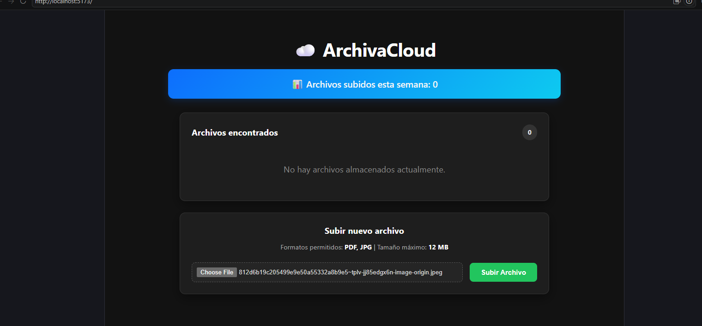

# Feature Extra – Contador de archivos subidos esta semana

## Descripción

La funcionalidad adicional implementada en ArchivaCloud consiste en mostrar en la pantalla principal un contador con la cantidad de archivos subidos durante los últimos siete días.
Esta información se presenta en la parte superior de la interfaz y permite al usuario conocer rápidamente la actividad reciente del sistema.

## Objetivo

Se eligió esta funcionalidad porque agrega información útil sin modificar el flujo principal de la aplicación.
Además, permitió incorporar lógica adicional tanto en el backend como en el frontend, haciendo el proyecto más completo.

## Funcionamiento

Cuando un usuario solicita una URL prefirmada para subir un archivo, el backend registra la operación en un archivo llamado `history.json`.
Cada registro almacena:

- Nombre (key) del archivo.
- Fecha y hora de la subida.

Posteriormente, cuando el frontend consulta el endpoint:

```
GET /api/files
```z    

el backend:

1. Obtiene los archivos actualmente almacenados en Amazon S3.
2. Sincroniza el historial para mantener registros consistentes.
3. Calcula cuántos registros fueron creados durante los últimos siete días.
4. Devuelve ese valor junto con la lista de archivos.

Finalmente, React muestra el contador en la pantalla principal.

---

## Decisiones de diseño
El contador no depende únicamente de los archivos existentes en S3.
Si un usuario elimina un archivo, la subida sigue formando parte del historial, por lo que el contador continúa reflejando correctamente la cantidad de archivos cargados durante la semana.
Para lograr este comportamiento se implementó un historial local (`history.json`) que conserva todas las subidas realizadas.

--

## Tecnologías utilizadas

- FastAPI
- React
- Amazon S3
- Python
- JSON (`history.json`)
- Amazon DynamoDB

---

## Evidencia



---

## Resultado

La funcionalidad fue implementada correctamente y cumple con el objetivo de proporcionar una estadística útil para el usuario sin afectar el funcionamiento principal del sistema.